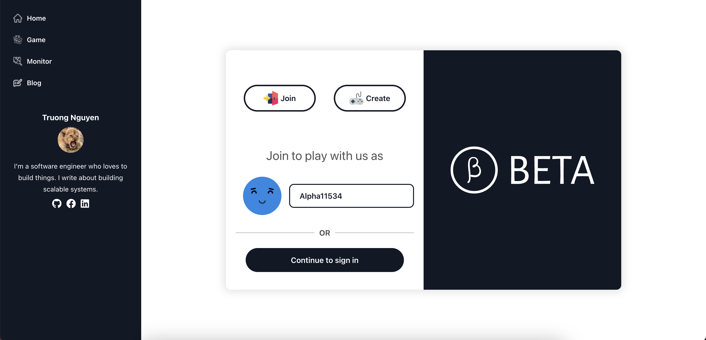
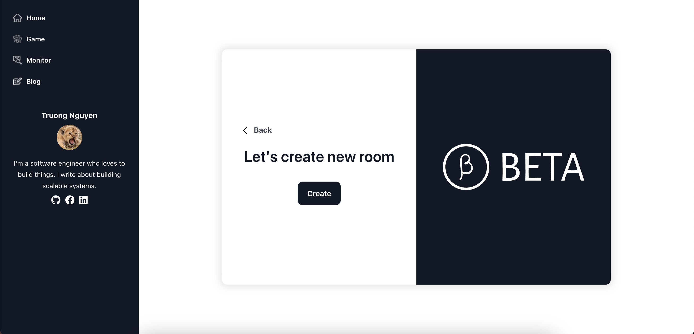
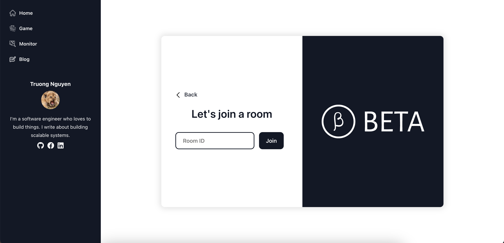
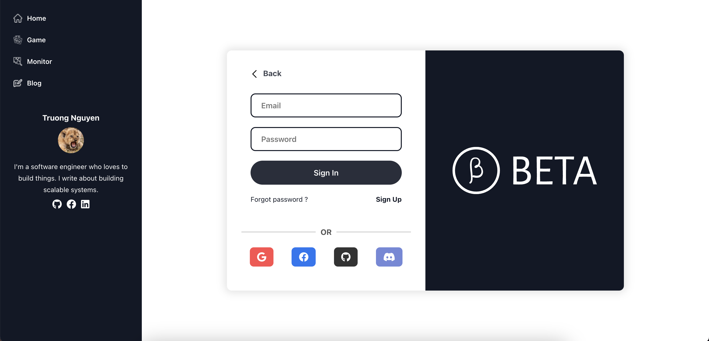
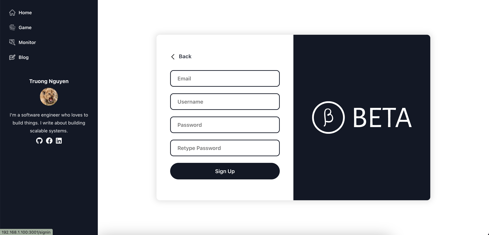

# POKER GAME CLIENT

## How to run

1. Install dependencies

```bash
npm install
```

2. Run the client

```bash
npm run start
```

3. Open the browser at http://localhost:3000

## Project structure

- `src` folder contains all the source code of the client
- `public` folder contains the static files of the client
- `package.json` contains the dependencies of the client
- `package-lock.json` contains the dependencies of the client
- `README.md` contains the instructions to run the client

- `src/index.js` is the main component of the client
- `src/assets` contains the assets of the client: images, icons, etc.
- `src/components` contains the components of the client
- `src/pages` contains the pages of the client

## Dependencies

- `react` is the framework used to build the client
- `react-router-dom` is the library used to manage the routes of the client
- `react-bootstrap` is the library used to build the UI of the client

## Website overview

- The website is composed of 4 pages: Home, Game, Monitors and Blog
- The Home page contains the description of the project which redirect to the github
  repository README of the project
- The Poker page is the main page of the website and contains the poker game
- The Monitors page contains the list of monitors of all the containers of the project
  by using grafana
- The Blog page contains the blog posts of the project which redirect to the notion page

## Some screenshots

- Home page
  

- Create a new game
  

- Join a game
  

- Sign in
  

- Sign up
  
